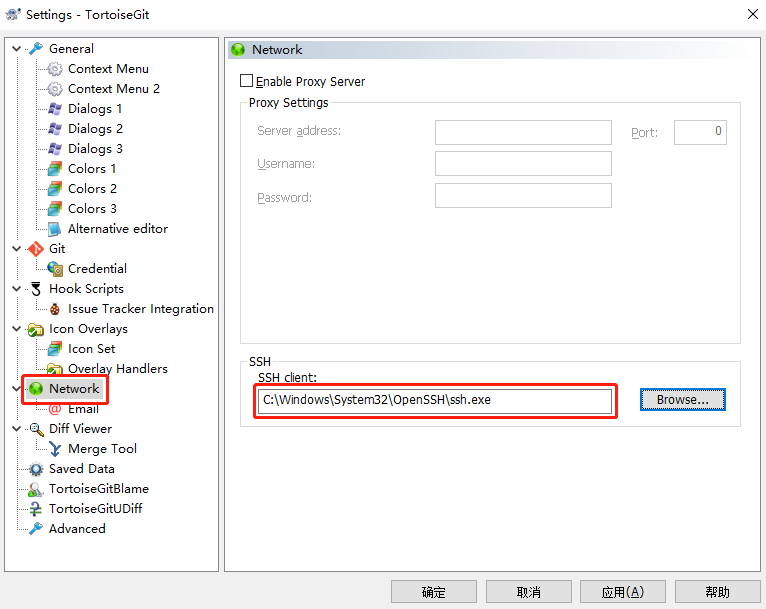

# Git 相关
## 首次提交被拒绝
如果刚创建的git仓库首次提交被拒绝，一般是因为远程仓库有修改过`README.md`导致本地的提交记录和远程仓库的记录完全不相同，git会认为你写错了远程仓库地址，这时候只需要在执行`git pull`时候告诉git你没写错地址即可
``` git
git pull origin master --allow-unrelated-histories
```
## git.exe客户端配置公钥秘钥
1. 检查是否有设置账户名
```git
git config user.name
```
如果没有，设置账户名
```git
git config --global user.name "git账户名"
```
2. 执行命令生成公钥秘钥
```git
ssh-keygen -t rsa -C 'xxxx@xxx.com'
```
生成的公钥位置`C:\Users\当前用户\.ssh\id_rsa.pub`
3. 同样去gitlib中将此次生成的公钥`id_rsa.pub`添加进去

## 提交代码时出现TortoiseGitPlink弹窗
1. 右键打开TortoiseGit设置中的`Network`选项卡。
2. 修改`SSH client`地址为`C:\Windows\System32\OpenSSH\ssh.exe`


## TortoiseGit配置公钥私钥（一般不用）
1. 运行TortoiseGit开始菜单中的PuTTYgen程序，创建RSA密钥对，然后保存。
2. 运行TortoiseGit开始菜单中的Pageant程序，并添加上一步中保存的私钥。
3. 将密钥对中的公钥，添加到gitlib账号中
::: tip 提示
如果出现可以`clone`代码但无法`pull`和`push`情况,则需要指定秘钥
在项目路径下右键设置——Git——Remote——Putty key指定刚才生成的秘钥
:::


