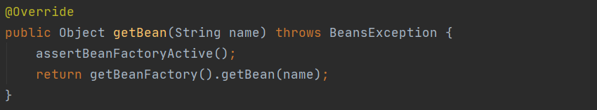
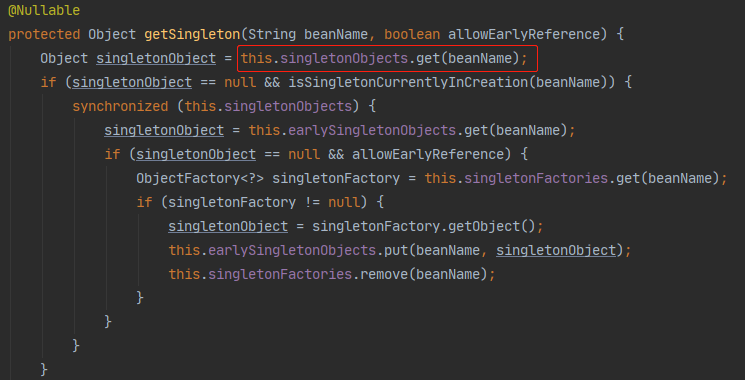
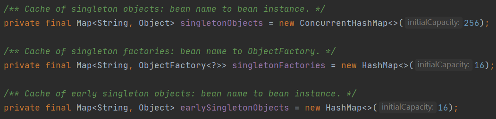
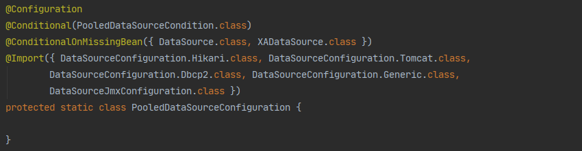
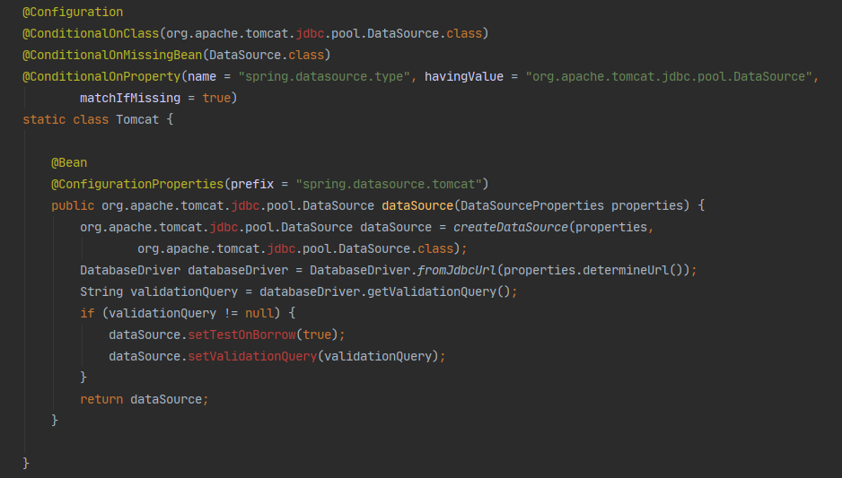
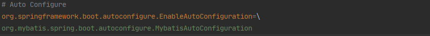
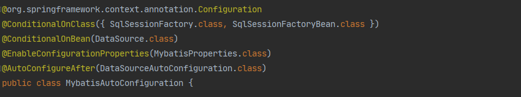
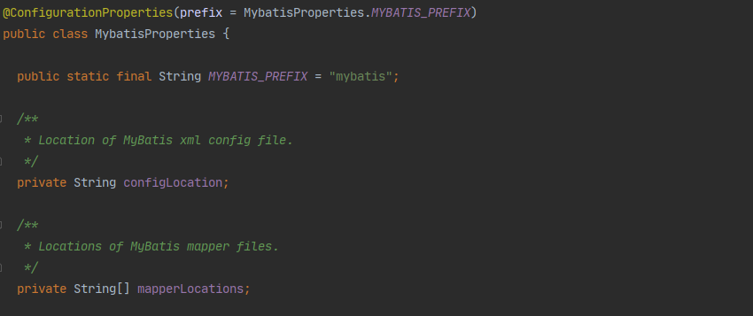

# SpringBoot
基于自己的理解，还有很多地方没看懂，以后慢慢补充     
## 一、SpringBoot自动配置原理
都知道`SpringBoot`有两个特点
* 去除掉了`xml`配置文件，全部使用`JavaBean`的方式初始化
* 约定大于配置，SpringBoot内部集成了大量默认配置，使开发人员仅仅用最基本的配置即可完成整体项目的搭建，简化了开发流程

基于这两个特点诞生了如下几个问题，弄明白这几个问题，SpringBoot的自动配置流程和原理也就基本明了了

1. SpringBoot是怎么去除掉了`xml`配置文件的，通过`JavaBean`的方式怎么将Bean放入容器中的？Spring中的bean容器是指的什么？
2. 怎么体现“约定大于配置”思想？
3. 项目启动时如何扫描到需要自动装配的类？

#### Bean容器是什么？
我们日常开发中各种controller，service，dao这些bean，都是存放在Bean容器中的，其中最常用的依据名称获取bean，因此通过代码观察Spring是从哪里拿的这些bean，就可以解决这个问题
首先入口选择了`applicationContext.getBean(name)`这个api，点进入可以看到如下，其中参数就是一个`String`类型

在往下点几层最终会调用一个`getSingleton`方法

可以看到是从`singletonObjects`中get出来的，这个属性就是一个Map，我们可以看到除了Bean容器外还有一些其他容器也是Map

那Spring中那些xml是怎么初始化后变成容器中的Bean呢？

其实核心流程就是去解析xml配置文件读取其中配置全限定名通过反射实例化一个bean出来放入容器中，当然还要处理一些bean之间的加载顺序和相互依赖问题，这些以后慢慢补充

#### JavaBean方式怎么替代XML实现初始化Bean？

根据以上我们知道其中容器中的Bean就是对象，那在代码中我们除了反射可以实例化出来一个对象，我们还可以用最常用的方式，`new`对象的方式通过`return`返回这个对象，也可以实现将对象放入容器中

SpringBoot是怎么识别哪些bean是需要初始化的？SpringBoot中提供了两个注解`@Configuration`、`@bean`，SpringBoot通过识别这两个注解，即可以识别配置类并且知道需要将哪些方法的返回值放入容器中

#### 怎么体现“约定大于配置”？

这里用DataSource举例，在项目中如果我们想操作数据库就必须在配置文件中配置好DataSource所必须的几个参数，系统在初始化的时候会通过读取`.yml`或`.properties`文件通过注解方式去判断加载对应的bean
我们从mybatis的自动配置类入手查看DataSource是如何加载的

SpringBoot中对自动配置的jar包遵循以`autoconfigure`结尾命名的规则，我们找到mybatis的自动配置包中的`MybatisAutoConfiguration`类
可以看到在类上有这样一个注解`@AutoConfigureAfter(DataSourceAutoConfiguration.class)`表明当前类是在注解中指定的类加载后进行加载的

接下来点进去`DataSourceAutoConfiguration`类，可以看到其内部类`PooledDataSourceConfiguration`中有如下几个注解

其中`@Import`引入了几个DataSource类，他们会通过注解的方式在不同情况下初始化，我们随便点一个类进入，可以看到一下几个注解

大致意思为必须满足如下几个条件才会加载这个Bean
1. 当前项目中必须引入了`org.apache.tomcat.jdbc.pool.DataSource.class`这个类
2. 当前容器中没有`DataSource.class`的bean
3. 配置文件中定义了`spring.datasource.type`属性，并且其value值为`org.apache.tomcat.jdbc.pool.DataSource`

满足以上才会初始化这bean并且放入容器中，在项目加载的时候就是用一个又一个的注解去做类似ifelse的逻辑判断，符合要求才会进行加载
附同类型注解解释

<table id="annotation">
    <tr>
        <th rowspan="9">条件依赖</th>
        <th class="colour-white">@ConditionalOnClass</th>
        <th class="colour-white">应用中包含某个类时，对应的配置才生效</th>
    </tr>
    <tr>
        <th>@ConditionalOnMissingClass</th>
        <th>应用中不包含某个类时，对应的配置才生效</th>
    </tr>
    <tr class="colour-white">
        <th>@ConditionalOnBean</th>
        <th>容器中存在指定class的实例对象时，配置才生效</th>
    </tr>
    <tr>
        <th>@ConditionalOnMissingBean</th>
        <th>容器中不存在指定class的实例对象时，配置才生效</th>
    </tr>
    <tr class="colour-white">
        <th>@ConditionalOnProperty</th>
        <th>指定参数的值符合要求时，对应配置才生效</th>
    </tr>
    <tr>
        <th>@ConditionalOnResource</th>
        <th>指定文件资源存在时，配置生效</th>
    </tr>
    <tr class="colour-white">
        <th>@ConditionalOnWebApplication</th>
        <th>当处于Web环境时（WebApplicationContext）对应配置生效</th>
    </tr>
    <tr>
        <th>@ConditionalOnNotWebApplication</th>
        <th>当不处于Web环境时（WebApplicationContext）对应配置生效</th>
    </tr>
    <tr class="colour-white">
        <th>@ConditionalOnExpression</th>
        <th>指定参数符合要求时，配置生效。和ConditionalOnProperty区别是这个注解使用SpringEl表达式</th>
    </tr>
    <tr>
        <th rowspan="3">先后顺序</th>
        <th>@AutoConfigureAfter</th>
        <th>在指定Configuration类加载后再执行</th>
    </tr>
    <tr class="colour-white">
        <th>@AutoConfigureBefore</th>
        <th>在指定Configuration类加载前执行</th>
    </tr>
    <tr>
        <th>@AutoConfigureOrder</th>
        <th>指定该Configuration类的加载顺序，默认值为0</th>
    </tr>
</table>

#### 项目启动时如何扫描到需要自动装配的类？

SpringBoot在启动时会默认自动扫描启动类所在的包及其子包下的所有`@Configuration`和`@Bean`注解，将返回对象放入容器中

那不在当前包下的配置类SpringBoot是怎么读取的呢？

SpringBoot会读取当前项目下所引入的所有名称以`autoconfigrue`或`starter`结尾命名的包，读取其`META-INF`下的`spring.factories`文件，其中该文件定义了当前包中所有的配置类
拿mybatis自动配置举例

SpringBoot在读取到这个文件后，去加载里面配置的自动类，点进去可以看到`@EnableConfigurationProperties`注解

这个注解大致意思就是告诉Spring将mybatis配置文件转换成bean，在后面所配置的类中可以看到如下

在这个类中会读取配置文件中以`mybatis`开头的属性设置到当前类中，同时可以看到`mapperLocations`属性，这里就是存储我们配置的`mapper-locations`属性对应的mapper文件

