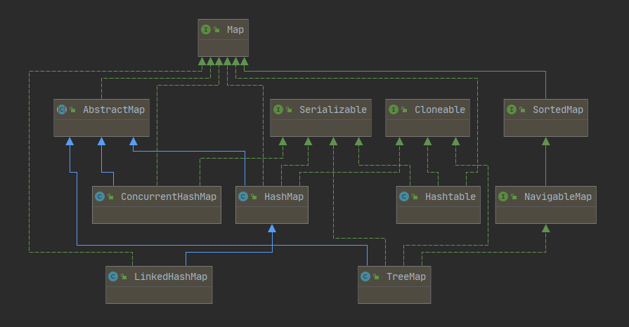
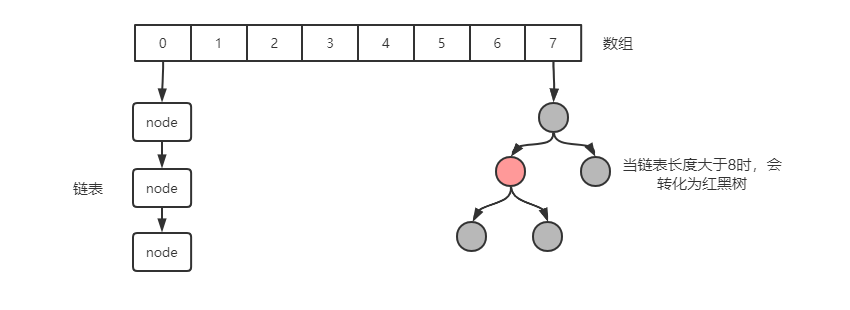

# 集合

## Map
Java中，一般耳熟能详的Map通常有这么几类（`HashMap`、`Hashtable`、`LinkedHashMap`、`TreeMap`）

他们之间的关系如下图所示


这几类Map的特点
* `HashMap` 用的最多，允许一个key为`null`，无序，非线程安全，在需要线程安全的场景下需要使用`Collections`的`synchronizedMap`方法或者`ConcurrentHashMap`类
* `ConcurrentHashMap` 线程安全，支持高并发，高吞吐量的map，内部实现采用分段锁技术
* `LinkedHashMap`有序的Map，是`HashMap`的一个子类，记录了插入的顺序，在使用`Iterator`遍历时，会按照插入顺序进行输出
* `TreeMap` 实现了`SortedMap`接口，也是有序的，默认按照字典序排序，也可以自定义比较器进行排序
* `Hashtable` 被弃用的类，功能和`HashMap`相似，线程安全，但性能比较差，因为同一时间只有一个线程可以执行写操作，没有遵循驼峰命名

这里就重点总结HashMap相关的内容

### HashMap
`HashMap`在`JDK7`中仅仅是数组+链表，而在`JDK8`中的存储结构优化为了数组+链表+红黑树


这样做的目的是如果在`key`很多的情况下，大量的数据由于哈希碰撞，聚集在同一个下标的元素上，这时链表的查询效率会退化成O(n)

`HashMap`存储数据时，是先计算`key`的哈希值，然后和数组长度-1相与（在`JDK7`中是进行取模运算）得到的值必定为数组中某一个下标的值，因此将该`key`放入这个数组所对应的链表中

这里用`JDK8`举例，看一下`put`方法时是如何处理的，在`put`方法中，最终调用了`putVal`方法

```java
final V putVal(int hash, K key, V value, boolean onlyIfAbsent,boolean evict) {
    Node<K,V>[] tab; Node<K,V> p; int n, i;
    // 对数组初始化，默认数组初始化长度为16
    if ((tab = table) == null || (n = tab.length) == 0)
        n = (tab = resize()).length;
    // Hash值和数组长度减一相与后，判断对应下标的数组元素中是否为空，如果为空则直接新建一个节点放入数组中
    if ((p = tab[i = (n - 1) & hash]) == null)
        tab[i] = newNode(hash, key, value, null);
    else {
        Node<K,V> e; K k;
        // 如果对应下标元素中已经存在节点，则判断这个节点中的key和当前key是否一致
        // 如果一致，则把旧节点赋予e，后续直接对节点e的value进行覆盖操作即可
        if (p.hash == hash && ((k = p.key) == key || (key != null && key.equals(k))))
            e = p;
        // 判断当前链表是否已经转换为红黑树，如果是，则进行红黑树插入值处理
        else if (p instanceof TreeNode)
            e = ((TreeNode<K,V>)p).putTreeVal(this, tab, hash, key, value);
        else {
            // 当链表中的头元素中的key不匹配时，进入到这里，遍历链表
            for (int binCount = 0; ; ++binCount) {
                // 判断当前链表节点的next元素是否为空，如果为空，则直接新建节点放入next即可
                if ((e = p.next) == null) {
                    p.next = newNode(hash, key, value, null);
                    // 判断链表长度是否超过8，若是则将链表转换为红黑树
                    // 注意在treeifyBin方法中又判断了数组长度是否大于64，若不大于仅仅做一次扩容
                    if (binCount >= TREEIFY_THRESHOLD - 1) // -1 for 1st
                        treeifyBin(tab, hash);
                    break;
                }
                // 若next节点不为空，则判断next节点的key是否和当前key相同
                // 如果相同，退出循环，后续进行覆盖value操作
                if (e.hash == hash && ((k = e.key) == key || (key != null && key.equals(k))))
                    break;
                // 如果next节点的key不一致，则将next节点赋予当前节点，继续遍历
                p = e;
            }
        }
        // 如果通过以上逻辑发现有相同的key，则在这里进行value值的覆盖，并返回旧数据
        if (e != null) { // existing mapping for key
            V oldValue = e.value;
            if (!onlyIfAbsent || oldValue == null)
                e.value = value;
            afterNodeAccess(e);
            return oldValue;
        }
    }
    ++modCount;
    // 判断数组元素数量是否超过长度*负载因子，是否需要扩容
    if (++size > threshold)
        resize();
    afterNodeInsertion(evict);
    return null;
}
```
从以上代码中可以看出，在`JD8`中插入数据时采用的是尾插法，同时在代码中我们可以看到`modCount`属性，这个属性记录的是当前容器对象被修改的次数，用于快速失败机制，所有非线程安全地集合类都存在该属性

::: tip Fail-Fast 策略
我们知道 java.util.HashMap 不是线程安全的，因此如果在使用迭代器的过程中有其他线程修改了map，那么将抛出ConcurrentModificationException，这就是所谓fail-fast策略。

这一策略在源码中的实现是通过 modCount 属性。modCount 顾名思义就是修改次数，对HashMap 内容的修改都将增加这个值。
在迭代器初始化过程中会将这个值赋给迭代器的 expectedModCount。
在迭代过程中，不断判断 modCount 跟 expectedModCount 是否相等，如果不相等就表示已经有其他线程修改了 Map，立刻抛出 ConcurrentModificationException 异常。
注意， modCount 声明为 volatile，以保证线程之间修改的可见性。
:::

上面的代码我可以看到在数组长度达到阈值的时候，会对数组进行扩容，并依据hash重新分配链表位置，下面我们看一下负责数组扩容的方法`resize()`

```java
final Node<K,V>[] resize() {
    Node<K,V>[] oldTab = table;
    // 这里判断MAP是否经历过初始化
    int oldCap = (oldTab == null) ? 0 : oldTab.length;
    // 下次扩容时的元素上限，如果在初始化时指定容量，实际修改的是threshold
    // 在后面会将threshold赋值给newCap，并且依据newCap重新计算threshold
    int oldThr = threshold;
    int newCap, newThr = 0;
    if (oldCap > 0) {
        // 判断旧数组长度是否大于2的30次方，如果大于则不进行扩容，仅仅是将threshold调整为int的最大值，后面介绍为什么是2的30次方
        if (oldCap >= MAXIMUM_CAPACITY) {
            threshold = Integer.MAX_VALUE;
            return oldTab;
        }
        // 判断数组扩容后是否小于2^30且是否大于等于默认容量
        // 未看懂为什么必须大于等于默认容量
        else if ((newCap = oldCap << 1) < MAXIMUM_CAPACITY &&
                 oldCap >= DEFAULT_INITIAL_CAPACITY)
            // 全满足后进行扩容一倍容量
            newThr = oldThr << 1;
    }
    // 如果初始化指定容量时，在这里会依据初始容量进行扩容
    else if (oldThr > 0)
        newCap = oldThr;
    else {               // zero initial threshold signifies using defaults
        // 对未指定初始容量的map使用默认容量和阈值
        newCap = DEFAULT_INITIAL_CAPACITY;
        newThr = (int)(DEFAULT_LOAD_FACTOR * DEFAULT_INITIAL_CAPACITY);
    }
    // 这里计算指定初始容量的Map的阈值
    if (newThr == 0) {
        float ft = (float)newCap * loadFactor;
        newThr = (newCap < MAXIMUM_CAPACITY && ft < (float)MAXIMUM_CAPACITY ?
                  (int)ft : Integer.MAX_VALUE);
    }
    threshold = newThr;
    @SuppressWarnings({"rawtypes","unchecked"})
        Node<K,V>[] newTab = (Node<K,V>[])new Node[newCap];
    table = newTab;
    if (oldTab != null) {
        // 遍历旧数组，重新计算元素在新数组的下标
        for (int j = 0; j < oldCap; ++j) {
            Node<K,V> e;
            // 判断原数组中当前下标是否有元素
            if ((e = oldTab[j]) != null) {
                oldTab[j] = null;
                // 判断链表上是否还有其他节点，如果没有就直接计算新数组中的下标
                if (e.next == null)
                    newTab[e.hash & (newCap - 1)] = e;
                // 判断链表是否转换为红黑树（暂时未看）
                else if (e instanceof TreeNode)
                    ((TreeNode<K,V>)e).split(this, newTab, j, oldCap);
                else {
                    // 假设从16扩容到32，那么经过重新计算得到的下标依旧在0-15中则成为低位，反正称为高位
                    // 用来保存低位的头元素和尾元素
                    Node<K,V> loHead = null, loTail = null;
                    // 用来保存高位的头元素和尾元素
                    Node<K,V> hiHead = null, hiTail = null;
                    Node<K,V> next;
                    do {
                        // 保存当前节点的next节点引用
                        next = e.next;
                        // 判断新下标是否为低位
                        if ((e.hash & oldCap) == 0) {
                            // 判断当前是否有头节点，如果没有，则把当前节点保存为头节点，否则将当前节点放入链表的尾部
                            if (loTail == null)
                                loHead = e;
                            else
                                loTail.next = e;
                            // 更新链表尾部指向
                            loTail = e;
                        }
                        else {
                            // 高位处理逻辑同低位
                            if (hiTail == null)
                                hiHead = e;
                            else
                                hiTail.next = e;
                            hiTail = e;
                        }
                    // 判断当前链表是否遍历完成
                    } while ((e = next) != null);
                    // 将低位的新链表放入新数组中
                    if (loTail != null) {
                        loTail.next = null;
                        newTab[j] = loHead;
                    }
                    // 将高位的新链表放入当前下标 + 旧数组长度位置
                    if (hiTail != null) {
                        hiTail.next = null;
                        newTab[j + oldCap] = hiHead;
                    }
                }
            }
        }
    }
    return newTab;
}
```

在代码中这个判断为什么只需要判断是否等于0`if((e.hash & oldCap) == 0)`，这是因为相与之后的结果只能是0或者是旧数组的长度

例如旧数组长度是16，有两个hash值分别是后八位分别是`1111 1111`和`1110 1111`，那么相与的结果分别是16和0，因此结果只取决于hash值中倒数第五的值是否为1，因此在本例子中，结果只能是0或者16


