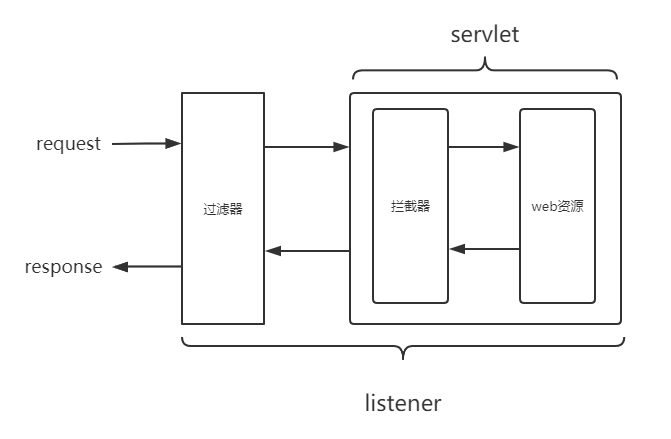
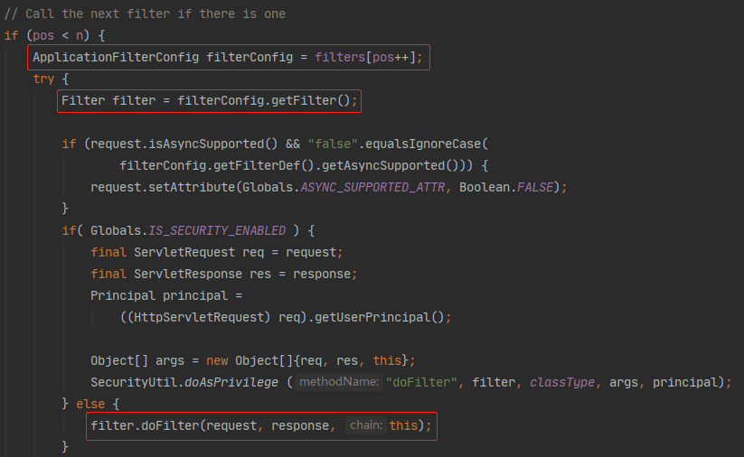
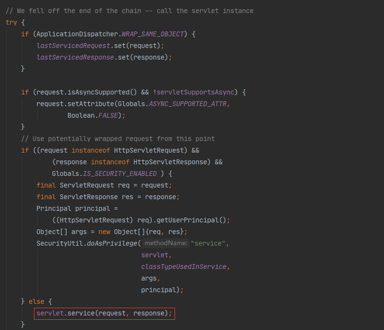

# 监听器、过滤器、拦截器

本章的每一节内容就是自己的理解，会随着经验的增加慢慢修改......
## 过滤器（Filter）
前两天项目中有一个增加监控日志的需求，选择了用过滤器的方式实现，写完后突然想到过滤器链一层一层向下调用，最后是怎么访问资源的呢，`chain.doFilter(request, response)`这个方法到底做了什么？
带着疑问看了下源码，在这里记录下，没全看懂，慢慢来吧

先看一下一个请求进到容器后的大概流程，其中过滤器是最先被执行的

::: tip 过滤器和拦截器的区别
 filter先于servlet启动，是随着web容器一起启动的，并且仅初始化一次，当过滤器调用完后，开始执行servlet的service方法，在service方法里会有拦截器的相关的逻辑
 filter是依靠函数回调完成的，而interceptor是依靠反射完成的，是面相aop切面编程的概念
:::

在实际写过滤器逻辑的时候，最后一定会写`chain.doFilter(request, response)`，但`doFilter`具体做了什么，通过debug发现，该方法传入`FilterChain`的实现类`ApplicationFilterChain`，当然不是只有这一个实现类

这里只写`ApplicationFilterChain`，用的最多的也是这个类，这个类在tomcat的包里，这也验证了`filter`是随着容器启动的，既然实现了这个接口，就一定有`doFilter`方法

在这个方法里看到有一句`internalDoFilter(request,response)`，点进去看一下

这里的`pos`和`n`分别表示当前的过滤器序号和过滤器链中全部过滤器数量，下面是这个类其中几个属性的解释
```java
    /**
     * Filters.
     */
    private ApplicationFilterConfig[] filters = new ApplicationFilterConfig[0];

    /**
     * The int which is used to maintain the current position
     * in the filter chain.
     */
    private int pos = 0;

    /**
     * The int which gives the current number of filters in the chain.
     */
    private int n = 0;

    /**
     * The servlet instance to be executed by this chain.
     */
    private Servlet servlet = null;
```
如果`pos < n`为`false`则进入到下面的流程


这里最后调用了`servlet`的`service`方法，这也印证了`filter`先于`servlet`执行

#### 多个过滤器之间的调用顺序是怎么指定的呢？

过滤器的调用顺序遵循`url`匹配优先级高于`servlet`名称匹配的规则，多个相同匹配规则之间则依据`web.xml`中配置的顺序来调用

下面引用[deepSleeping博客](https://www.cnblogs.com/deepSleeping/p/9609809.html)的一个例子，有三个过滤器分别做如下配置

```java
<servlet-mapping>
  <servlet-name>myServlet</servlet-name>
  <url-pattern>/foo*</url-pattern>
</servlet-mapping>

<filter-mapping>
  <filter-name>servletFilter</filter-name>
  <url-pattern>myServlet</url-pattern>
</filter-mapping>

<filter-mapping>
  <filter-name>myFilter</filter-name>
  <url-pattern>/foo*</url-pattern>
</filter-mapping>

<filter-mapping>
  <filter-name>anotherFilter</filter-name>
  <url-pattern>/foo/bar</url-pattern>
</filter-mapping>
```
如果一个普通的请求访问的URL是`/foo/bar`，那么它将匹配所有这3个过滤器。
过滤器链将由3个过滤器组成，依次为`myFilter`、`anotherFilter`、`servletFilter`。
`myFilter`将在`anotherFilter`之前执行,因为这是它们出现`web.xml`中的顺序。`servletFilter`最后执行,因为URL映射总是在Servlet名称映射之前执行。

