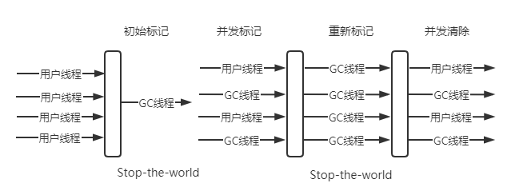

# JVM 

### 目录
----------
* [垃圾回收机制](#垃圾回收机制)
    * [如何判断哪些对象需要被回收？](#如何判断哪些对象需要被回收？)
    * [垃圾回收算法](#垃圾回收算法)
    * [垃圾回收器](#垃圾回收器)
        
## 垃圾回收机制

### 如何判断哪些对象需要被回收？

在`Java`中垃圾回收机制主要是针对堆内存进行的，垃圾回收总体上可以看做两种，一个是针对堆中的实例对象进行回收，另一种是针对方法区的回收

方法区回收主要回收两种对象，常量池中的的常量，比如常量池中有一个字符串“abc”，但当前系统中没有一个String对象引用了常量池中的“abc”，也没有其他地方引用了这个字面量
如果这时候发生垃圾回收，且有必要的话，这个字符串就会被清理

方法区中另一个被清理的对象为无用的类，判断一个类是否无用需要以下几个条件同时满足
* 改类的所有实例都已经被回收
* 加载该类的`ClassLoader`已经被回收
* 该类的`Class`对象没有任何地方引用，无法在任何地方通过反射访问该类

当然并不是说满足这三个条件后就一定会被回收，仅仅是可以被回收

在垃圾回收中，执行次数最多的是针对堆中对象的回收，但在回收之前，`JVM`必须要知道哪些对象需要进行回收，通常有如下几种方式

* 引用计数算法
* 可达性分析算法

### 引用计数算法

该方法是通过在对象头中开辟一个空间，专门用来保存当前对象被引用了几次的，如果该标志位为0，表明无法再拿到这个对象了，该对象对于系统来说无用了，这时这个对象就可以被回收掉

但有这样一种情况，有两个对象，A和B，互相引用，并且双方的声明引用都为`null`，意味着在代码中是不可能拿到这两个对象了，但由于互相引用，导致双方的标志位都为1，这种对象在`引用计数算法`中是无法被回收的，也是由于这种情况，`JVM`普遍不采用这种算法判断对象是否回收

### 可达性分析

这种算法的思路是通过寻找`GC Roots`对象，并且顺着这些对象向下搜索，搜索的这个链路被称为`Reference Chain`，在这个链路上的对象是不会被回收的。

::: tip 可以作为GC Roots的对象
1. 虚拟机栈中正在引用的对象
2. 本地方法栈中正在引用的对象
3. 静态属性引用的对象
4. 方法区常量引用的对象
:::

当一个对象到一个`GC Roots`对象之间没有任何一条引用链`Reference Chain`时，可以称这个对象到`GC Roots`不可达，也就是可以被回收，这种方式可以避免对象之间的循环引用。


上图中灰色的对象就可以称为不可达对象

但并不是将声明引用赋为`null`后对象就是不可达状态了，引用分为以下几种类型
* 强引用（StrongReference）：最常见的是声明引用（普通对象引用），在`GC`中只要一个对象有强引用就不会被回收
* 软引用（SoftReference）：JVM认为内存不足时，才会去试图回收软引用指向的对象。基于这种特性，我们将软引用用在缓存场景，下面是软引用的常用`API`
```java
ReferenceQueue<Object> referenceQueue = new ReferenceQueue<>();
Object object = new Tts();
SoftReference<Object> softReference = new SoftReference<>(object,referenceQueue);
object = null;
// 如果软引用指向的对象被回收后，那么软引用对象会被放入对应的引用队列中，可以通过poll方法来判断是否有对象被回收了
// 如果返回null说明软引用指向的对象未被回收
referenceQueue.poll();
// 获取软引用指向的对象，可以通过softReference.get()方法，如果该对象被回收，则返回null
softReference.get();
```
* 弱引用（WeakReference）：与软引用类似，软引用是在内存不足时考虑回收，弱引用随时都会被回收掉
* 虚引用（PhantomReference）：不能通过该引用获取到对象了，当GC发现虚引用对象时，会去检查是否覆盖`finalize`方法，如果覆盖了，则会放入一个队列后续执行该方法，然后第二次GC时将对象变为不可达对象回收掉

### 垃圾回收算法

知道了哪些对象需要被回收后，就该考虑怎么回收这些对象，有下面几个算法
* 标记-清除算法
* 复制算法
* 标记-整理算法
* 分代收集算法

下面会介绍每种算法的优缺点和场景

### 标记-清除算法

这种算法是最基础的一种回收算法，这种算法分为两步，先将需要被回收的对象标记出来，整体标记完成后，将被标记的对象清理掉

这种算法的使用起来很简单，但有两个不足一个是效率问题，因为在标记阶段，需要遍历所有的`GC Roots`对象，在清除阶段需要遍历所有对象，将其中被标记的对象清除掉。

另一个问题是，内存碎片问题。

标记清除后会产生大量不连续的内存碎片，空间碎片太多会导致以后分配比较大的对象时，无法找到足够的连续内存，只能被迫进行下一轮GC

### 复制算法

复制算法将内存按照容量划分为大小相等的两块，每次只是用其中一块，当这一块的内存用完时，将这一块内存上还存活的对象复制到另一块内存中，然后在把之前的那部分内存整体清理掉

这种算法解决了标记-清除算法的效率和碎片问题，但带来了另一个问题，就是会浪费一半的可用内存。

### 标记-整理算法

这种算法同样是在标记-清除算法基础上改进的，标记过程和标记-清除算法一样，但后续步骤不是直接对可回收对象进行清理，而是让所有存活对象向一端移动，然后直接清理边界以外的内存

### 分代收集算法

这种算法并不算是一种算法，可以理解为是一种策略，虚拟机针对不同内存区域采用不同的回收算法。

一般而言Java堆分为新生代和老年代，而大部分的新对象的存活时间很短，可能只能经历一次GC就被回收了，因此针对新生代的回收算法采用**复制算法**，并且不需要将新生代内存按照1:1的比例分配。

#### 新生代回收策略

`HotSpot`默认将新生代分为一块较大的`Eden`区域和两块较小的`Survivor`区域，它们之间的比例为8:1:1

当新生代内存不够用时，`JVM`会发起一次`Minor GC`，将`Eden`区域和一块`Survivor`中的还存活的对象放入另一块`Survivor`空间，然后清理掉之前使用过的`Eden`和`Survivor`区域，`Minor GC`会比`Major GC`更频繁，回收速度也更快

`Survivor`存在意义就是减少被送到老年代的对象，进而减少`Major GC`的发生。`Survivor`的预筛选保证，只有经历16次`Minor GC`还能在新生代中存活的对象，才会被送到老年代。

但也有例外，如果在某些场景下新生代存活的对象比较多`Survivor`区域放不下时`JVM`会将一部分对象通过**分配担保机制**放入老年代

#### 老年代回收策略

老年代发生的是`Major GC`，相对的老年代中的对象比较坚挺，但也有例外，除了大对象和经历16次`GC`后的依旧存活的对象可以进入老年代外，还有下面这种情况可以进入老年代

> 虚拟机并不强制要求对象年龄达到15岁（16次`GC`），如果`Survivor`空间中相同年龄所有对象大小的综合大于`Survivor`空间的一半，年龄大于等于该年龄的对象就可以直接进入老年区

在老年代发生的`GC`时，采用**标记-整理算法**。老年代发生`GC`的频率不如新生代那么多，而且老年代的对象都比较坚挺，如果采用复制算法，会造成大量对象被复制，同时又因为老年代承担了存放大对象的职责，因此需要**标记-整理算法**清理出一块连续的内存空间

### 垃圾回收器

通过上面我们知道怎么判断一个对象是否需要被回收，知道了采用什么方式将对象回收，这时候该执行者出场了，**垃圾回收器**就是`GC`任务的执行者

`JVM`中提供了很多垃圾回收器，下面会分别介绍常见的垃圾回收器及其使用场景

#### Serial（串行收集器）

该收集器是一个单线程的收集器，他在执行垃圾回收时，必须暂停其他工作线程`Stop The World`，是`Client`模式下JVM默认选项，作用于新生代，采用复制算法


`Stop-The-World`是在虚拟机在后台自动发起和完成的。

#### Serial Old

是`Serial`老年代版本，使用的标记-整理算法，主要用于`Client`模式下使用

但如果在是在`Server`模式下使用，则有两个用途，一是在JDK1.5之前与`Parallel`配合使用，另一个是作为`CMS`收集器的后备方案使用

#### Parallel（并行收集器）

`server`模式下默认的`GC`选择，整体算法和`Serial`比较相似，但在该收集器是并行进行的，值得注意的是这是一个新生代的垃圾回收器，采用的是复制算法，这个收集器也经常被称为吞吐量优先的收集器

吞吐量=业务代码运行时间 / (业务代码运行时间 + GC时间)


`GC`停顿时间越少，系统的吞吐量就越大

下面是关于该收集器的几个参数
> -XX:ParallelGCThreads: 设置用于垃圾回收的线程数。通常情况下可以和CPU数量相等
>
> -XX:MaxGCPauseMills: 设置最大垃圾收集停顿时间。一个大于0的整数
>
> -XX:GCTimeRatio: 设置吞吐量大小，是一个0-100的整数。
>
> -XX:+UseAdaptiveSizePolicy: 打开自适应GC策略，已达到在堆大小。吞吐量和停顿时间之间的平衡点。默认打开

#### Parallel Old收集器

是`Parallel`的老年代版本，这个是在JDK1.6之后提供的，在这个收集器出现之前，`Parallel`一直是和`Serial Old`配合使用，但由于`Serial Old`性能上的瓶颈，导致`Parallel`在整体应用上也无法产生较高的吞吐量

#### CMS收集器

是一种以获取最短回收停顿时间为目标的收集器，专用于老年代，基于标记-清除算法实现，对于互联网行业时间敏感的系统非常重要，但由于采用的是标记-清除算法，因此会有一些内存碎片，随着时间的增加，会不得不触发full GC来回收垃圾

> CMS 由于性能已经没有太多可以改进的地方，jdk1.8时宣布放弃维护，但目前还未剔除，取代者为G1收集器

其整体的运行步骤分为四步

* 初始标记（需要stop the world，但仅仅只是标记一下`GC Roots`，速度很快）
* 并发标记（多个线程进行`GC Roots Tracing`，判断对象是否仍在使用中，可达性分析）
* 重新标记（需要stop the world，目的是为了修正并发标记期间因用户线程新产生的对象）
* 并发清除



#### ParNew收集器（并行收集器）

专用于新生代GC，是Serial GC的多线程版本，目前只有该收集器可以配合CMS GC使用


#### G1收集器

JDK9后的默认选型 目标是代替CMS收集器使用，在G1之前的收集器的作用范围都是新生代或者是老年代，而G1不是这样，它可以管理整个Java堆

它将堆化为多个大小相等的独立区域`Region`虽然还保留新生代和老年代的概念，但新生代和老年代不是物理隔离，他们都是一部分`Region`的集合（不需要连续的内存地址）

`Region`之间采用复制算法，但对于堆内存中整体上可以**看做**标记-整理算法，在GC回收时会对`Region`进行整理


