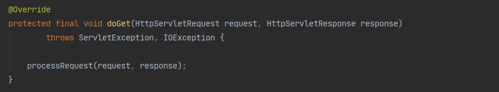

# SpringMVC

## 一、SpringMVC如何对请求进行解析？

在SpringMVC中一个请求最终是由`servlet`接口中的`service`方法解析，从流程图上看，这个`dispatcherServlet`就是`servlet`的实现类
但该类并未直接实现`servlet`接口，而是通过多次继承间接了的实现了接口，其实现关系为

**DispatcherServlet --> FrameworkServlet --> HttpServletBean --> HttpServlet --> GenericServlet**，而`GenericServlet`最终实现了`Servlet`接口

由于我们已经知道处理请求的关键是`Servlet`中的`service`方法，因此我们直接去找这个方法，可以看到这个方法最后一次复写是在`HttpServlet`类中（注意`Servlet`中的`service`方法参数是`ServletRequest`和`ServletRequest`类型）

在这个方法里Spring并没有对请求真正进行处理，只是将参数的类型强转成了`HttpServletRequest`、`HttpServletResponse`类型

然后继续调用`service(httpServletRequest, httpServletResponse)`方法，由于在`FrameworkServlet`复写了该方法，因此优先调用子类中的方法，在子类中只做了一件事，判断是否是`patch`类型的请求。

若是，则不调用父类方法，直接开始解析请求，由于在debugger时是一个get请求，因此在这里调用了父类中的方法

在父类中的对请求类型进行了判断，如果是`post`、`put`、`delete`则不作其他逻辑判断，直接调用`doPost`方法即可，如果是`get`请求，则通过判断`http`中的`if-modified-since`属性来决定是否对请求进行处理
> 在http中Last-Modified 与If-Modified-Since 都是用于记录页面最后修改时间的 HTTP 头信息。
> 注意,在这 Last-Modified 是由服务器往客户端发送的 HTTP 头，另一个 If-Modified-Since是由客户端往服务器发送的头。
> 再次请求本地存在的 cache 页面时，客户端会通过 If-Modified-Since 头将先前服务器端发过来的 Last-Modified 最后修改时间戳发送回去。
> 这是为了让服务器端进行验证，通过这个时间戳判断客户端的页面是否是最新的，如果不是最新的，则返回新的内容，如果是最新的，则 返回 304 告诉客户端其本地 cache 的页面是最新的，于是客户端就可以直接从本地加载页面了。
> 这样在网络上传输的数据就会大大减少，同时也减轻了服务器的负担。

判断后调用`FrameworkServlet`的`doGat`方法，在这个方法中只有一句话

点进去继续看，在这个方法中，初始化了一些属性值这里我们不过多关注，只看主流程，真正处理请求的是`doService(request, response)`方法

而在`doService`中我们发现真正对请求进行处理的是`doDispatch(request, response)`方法

从名称上看开始对请求进行分发了，其中两个方法比较关键，一个是`getHandler`，获取当前的请求的处理器，一个是获取处理器对应的适配器

我们先来看是如何获取的Handler的，在`getHandler`方法中，将遍历已经初始化好的handlerMapping

在这里面有一个`RequestMappingHandlerMapping`，这个就是实际负责将带有`@RequestMapping`注解的方法，添加到这个映射关系中去

`mapping.getHandler`在这个方法中，通过往下调用，最终会调用到`AbstractHandlerMethodMapping`这个类中的`addMatchingMappings`方法
通过debugger可以看到，Spring将所有的URL映射关系全部放入一个map中，在这个方法中将当前请求路径对应的bean拿到

拿到bean后，我们返回到`getHandler`方法，继续往下走，发现这个方法`getHandlerExecutionChain`返回了一个`HandlerExecutionChain`，在这个方法中，只做了一件事，就是找到这个URL匹配的拦截器
将其放入处理器执行链，其由`controller`和拦截器组成

在拿到这个处理器执行链后，`getHandler`方法可以基本完成了他的使命，返回到`DisPatcherServlet`中
代码继续往下走，这里可以看到如果没有拿到对应的处理器，则这个请求开始返回404

接下来我们在关注`getHandlerAdapter`这个方法，这个方法是获取处理器对应的适配器，在这个方法中依旧遍历已经初始化好的适配器，显然这里使用`RequestMappingHandlerAdapter`

在拿到适配器后程序继续向下走，直到看到这样一段代码，这里显然开始真正执行请求了

在这个方法中通过一层一层调用最终执行到这样一个方法，在这里进行反射调用，执行了最终`controller`方法，我们定义的`controller`流程执行完了

最后通过`mappedHandler.triggerAfterCompletion()`方法完成拦截器中的`afterCompletion`方法

